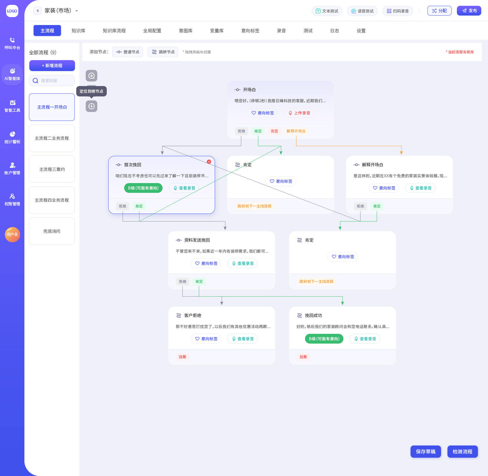

# Generator for AI Customer Service Agent

This a GUI software that allows business managers to freely design customer service 
agents with pre-defined conversation flows, using intuitive nodes and edges.
The agent's engagement with customers is powered by large language models (LLMs) and 
natural language processing (NLP).

The conversation flows behind the agent are composed with:
- **Base nodes** that can send preconfigured replies and identify intentions from customer replies in real time.
- **Transfer nodes** that respond with pre-defined replies as well and transfer the conversation to another conversation flow.
- **Edges** that connect nodes and define conditional logic.  

A well-designed agent can effectively handle customer service tasks and delivery business-promotion objectives. 
Below is an example of the GUI showing a sample conversation flow with nodes and edges:  



## 1. Features

-   **Custom Conversation Flow**: Freely orchestrate dialogue logic
    using base nodes, transfer nodes, and conditional edges
    based on **business needs** and **previous experiences of customer engagements**.
-   **Multi-strategy Intention Detection**: Leverage keyword matching,
    semantic similarity based on NLP, and/or LLM-based AI reasoning. 
    You can choose to use one or multiple methods for detecting customer intentions.
-   **Custom Intention Library**: Define regular intentions to detect from customer replies and
    use them to build base nodes and add edges accordingly to design conversation flows.
-   **Custom Knowledge Base**: For **regular questions** that customers may ask
    at any point, create knowledge intentions with a **RAG approach**. You
    can also configure whether a node prioritizes its local regular intentions or
    the global knowledge intentions.
-   **Real-time Response**: Low-latency dialog processing suitable for
    telephone environments.
-   **Highly Configurable**: Choose to ignore certain knowledge intentions in selected nodes;
    set a maximum number for matching a knowledge intentions; set up conversation flows for
    knowledge base; use variables in the response, etc.
-   **High Concurrency Supported**: Multiple users with different thread ids can interact with the agent without conflicts.

## 2. Technical Architecture

### 2.1 Core Models

| Component | Model Used                                                                                                                                                                                                                                 | Description                                                |
|-----------|--------------------------------------------------------------------------------------------------------------------------------------------------------------------------------------------------------------------------------------------|------------------------------------------------------------|
| **Embedding Model** | [Qwen3-Embedding-0.6B](https://huggingface.co/Qwen/Qwen3-Embedding-0.6B)                                                                                                                                                                   | Used for semantic vectorization and similarity calculation |
| **Large Language Model** | [Qwen-Plus](https://modelstudio.console.alibabacloud.com/?tab=doc#/doc/?type=model&url=2840914_2&modelId=qwen-plus), [DeepSeek-Chat](https://huggingface.co/deepseek-ai/DeepSeek-V2-Chat), or [GLM 4.6](https://huggingface.co/zai-org/GLM-4.6) | Used for complex intent recognition and structured output  |

### 2.2 Tech Stacks

-   **Agent Framework**: [LangGraph and LangChain](https://www.langchain.com/langgraph)
-   **Memory/Storage Management**: [Redis](https://redis.io/)
-   **Vector Database**: [Milvus Standalone](https://milvus.io/)

### 2.3 Environment Requirements

-   **Python**: 3.8 or above (3.11 recommended)
-   **Dependencies**: See `requirements.txt`

## 3. Quick Start

### 3.1 Environment Setup

``` bash
# Clone the project
git clone https://github.com/lituokobe/event-marketing-agent
cd customer-service-bot

# Install dependencies
pip install -r requirements.txt
```

### 3.2 API Key Configuration

- Register an [Alibaba Cloud](https://www.alibabacloud.com/) account and obtain an API Key for Qwen-Plus, and/or
- Register a [DeepSeek](https://platform.deepseek.com/) account and obtain an API Key for DeepSeek-Chat, and/or
- Register a [BigModel](https://bigmodel.cn//) account and obtain an API Key for GLM 4.6.
- Fill in your preferred API keys in `models.models.py`.

``` bash
ALI_API_KEY=your_aliyun_api_key
DEEPSEEK_API_KEY=your_deepseek_api_key
GLM_API_KEY=your_glm_api_key
```

### 3.4 Technical setup
- Prepare Milvus Standalone and input the service's URL to `data.simulated_data.py` - `agent_data` - `"vector_db_url"`
- Deploy Qwen3-Embedding-0.6B service and input the service's URL to `functionals.embedding_functions.py` - `EMBED_SERVICE_URL`
- You may choose to ignore the above 2 steps if you don't use semantic similarity matching. Simply set `data.simulated_data.py` - `agent_data` - `"enable_nlp"` to 0
- Prepare Redis and input the service's information to `config.db_setting.py` - `DBSetting`

### 3.4 Project Data

The design and configuration are supposed to be setup by the business managers in the GUI, and act as the data to launch the agent.
In `data.simulated_data.py`, there are examples:

-   `agent_data` --- High level configuration of the agent, deciding which features to enable and services to use.
-   `chatflow_design` --- Conversation flow configuration including
    main flow, nodes, and conditional edges. Users can fully customize
    this to build different customer-service bots
-   `global_configs` --- Global configurations on the agent when there are no matching intentions or customers have no replies.
-   `intentions` --- Library of regular intentions. Nodes will use specific intentions according to project needs
-   `knowledge` --- Knowledge intentions for answering regular customer questions, this is optional.
-   `knowledge_main_flow` --- Conversation flow for knowledge intentions, this is optional as well.

### 3.5 Run a Test

``` bash
python run_chatflow.py
```

## 4. How It Works

### 4.1 When LLM Mode Is Enabled

-   The system uses the LLM for intention identification.
-   You can set an LLM confidence threshold. When the LLM score is below
    this threshold (e.g., 3), the system falls back to the two non-LLM
    methods below.

### 4.2 When LLM Mode Is Disabled

#### Layer 1: Keyword Retrieval

-   Uses an AC Automaton to quickly match predefined keywords (regular expressions supported).
-   When keywords match, the corresponding intent is returned
    immediately.

#### Layer 2: Question-pattern Understanding

-   Retrieves the most similar question pattern using vector similarity.
-   Cosine similarity threshold: ≥ 0.8
-   Uses the vector database (Milvus) for efficient retrieval.

